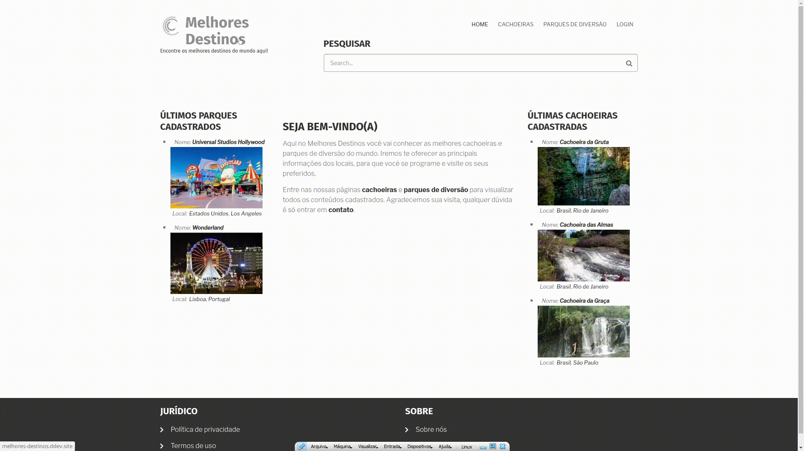

# Melhores Destinos
# Sobre o projeto

Projeto desenvolvido ao final do programa New Thinkers da <a href="https://www.squadra.com.br">Squadra Digital</a>. O objetivo desse desafio foi desenvolver um site em Drupal para aplicar todo o conteúdo apresentado durante o Bootcamp.  

## Demonstração 💻

## 🚀 Tecnologia Utilizada

- ✔️ [Drupal](https://www.drupal.org/)

## 📋 Módulos Instalados

- ✔️ Admin Toolbar

- ✔️ Pathauto 

- ✔️ CTools

- ✔️ Token

- ✔️ Devel

- ✔️ Drush

